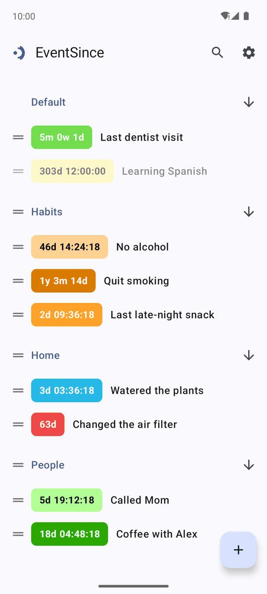
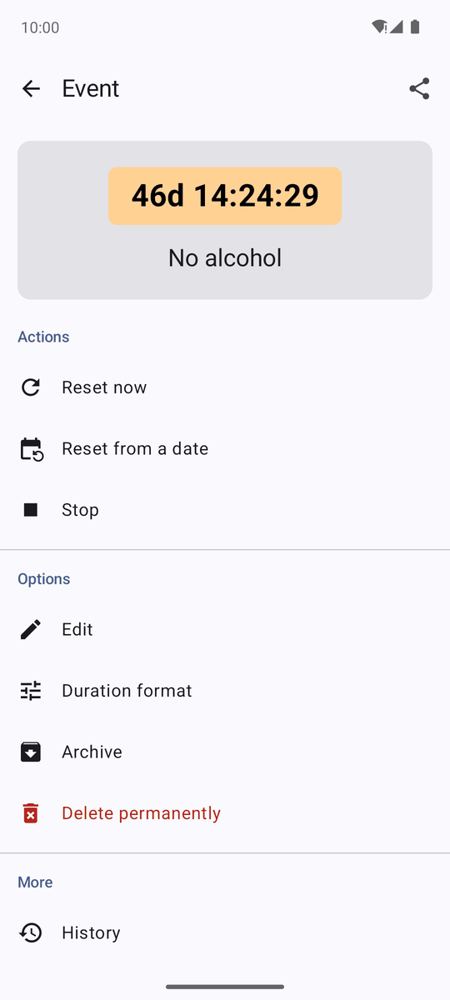
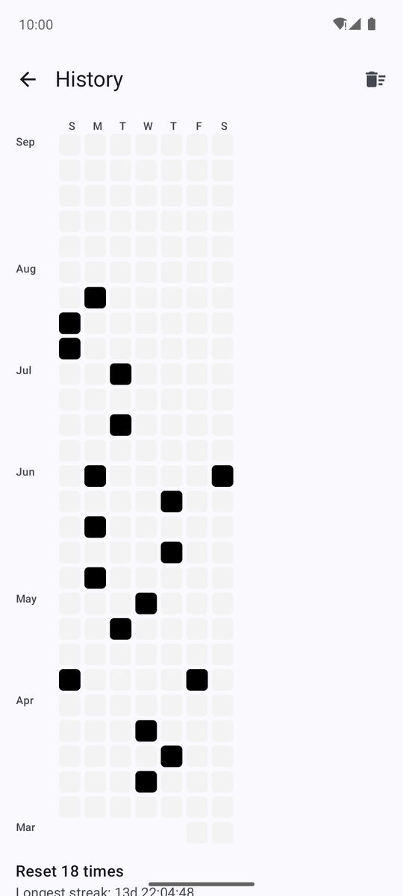
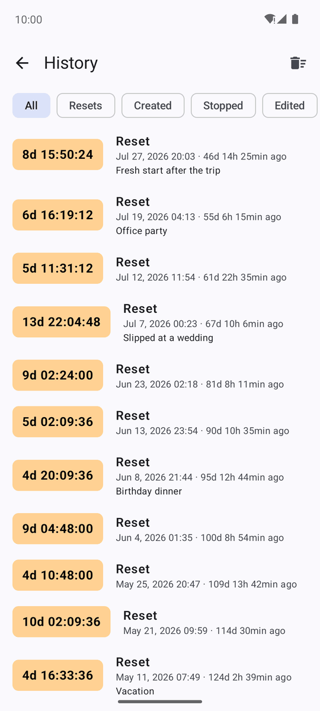
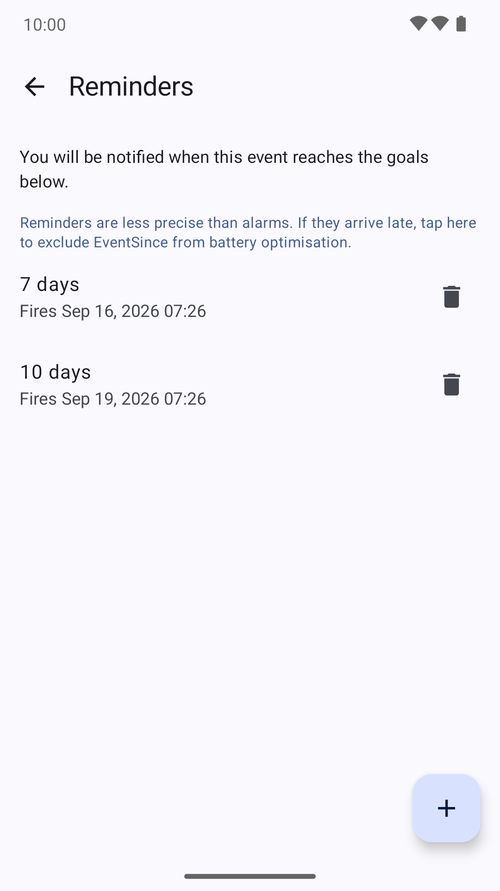
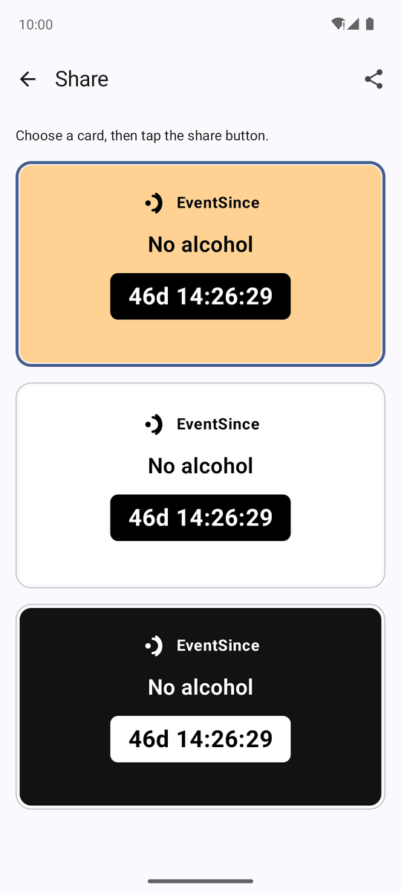
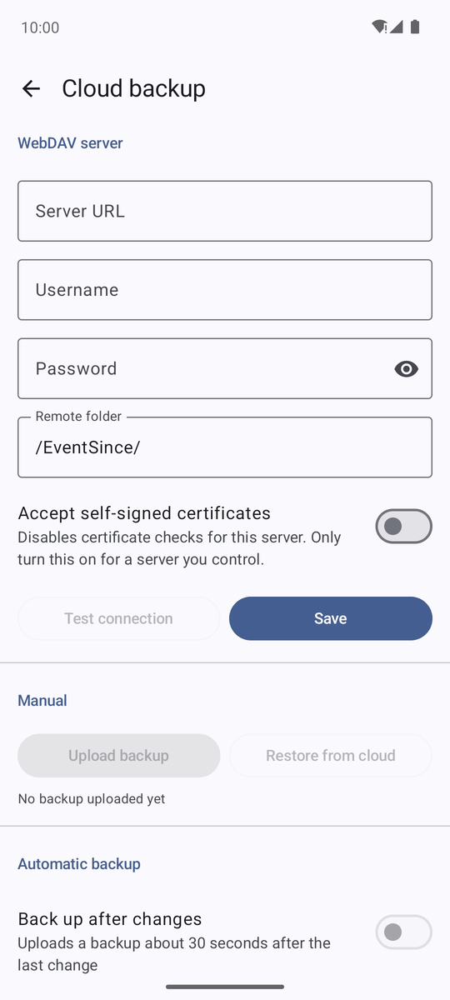
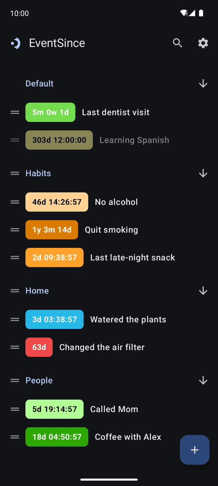

# EventSince (事起)

EventSince is an Android app that keeps track of how long it has been since something
happened: the day you quit a habit, the last time you called a friend, the start of a
project, the last time you watered the plants. Each event shows a live counter, can be
reset to start a new streak, and keeps a full history of every reset so you can look back
at how you have been doing.

The app is written in Kotlin with Jetpack Compose and Material 3, targets Android 13
(API 33) and later, and is released under the Apache License 2.0.

## Screenshots

<table>
  <tr>
    <td></td>
    <td></td>
    <td></td>
    <td></td>
  </tr>
  <tr>
    <td align="center">Home</td>
    <td align="center">Event</td>
    <td align="center">Reset heatmap</td>
    <td align="center">History</td>
  </tr>
  <tr>
    <td></td>
    <td></td>
    <td></td>
    <td></td>
  </tr>
  <tr>
    <td align="center">Reminders</td>
    <td align="center">Share card</td>
    <td align="center">Cloud backup</td>
    <td align="center">Dark mode</td>
  </tr>
</table>

## Features

- **Events.** Each event has a label, a colour, a category and a start date and time.
  Events can be reset (now or from a chosen moment), stopped, edited, archived and
  permanently deleted. An optional note can be attached to every reset.
- **Live counters.** Elapsed time is shown in any combination of years, months, weeks,
  days, hours, minutes and seconds. The unit set can be changed globally or per event.
- **History and heatmap.** Every operation on an event (creation, reset, stop, edit,
  archive, import) is logged. A calendar heatmap shows how often an event was reset and
  jumps to the matching log entry.
- **Categories.** Events are grouped into categories that can be renamed, reordered and
  deleted, with a choice of what happens to the events they contain.
- **Goal reminders.** Set a target such as "7 days" or "1 year" and get a notification
  when the event reaches it. Reminders use exact alarms and survive reboots and time
  zone changes.
- **Colour palettes.** Fifteen colours in each of ten palettes, including one derived
  from the device's Material You colours. The app itself follows the system dynamic
  colour scheme with light and dark modes.
- **Local backup.** Export all data as a compressed zip archive and import it back,
  either replacing the current data or merging into it.
- **WebDAV cloud backup.** Upload backups to any WebDAV server, restore from the server,
  keep a limited number of remote copies, and optionally back up automatically after
  every change (Wi-Fi only if you prefer). The password is stored encrypted with the
  Android Keystore.
- **Home-screen widgets.** A standard widget that shows an event's counter, and a
  variant with a reset button.
- **Share cards.** Render an event as an image and share it with other apps.
- **Search.** Filter the home screen by label.
- **Languages.** English and Simplified Chinese, switchable inside the app.

## Relationship to TimeSince

EventSince is a clean-room reimplementation of [TimeSince](https://time-since-multi-time-counter.en.softonic.com/android)
(`es.desaway.timesince`), an Android app that is no longer available in the app stores.
It was developed from a written description of TimeSince's behaviour and data formats
only, without access to its source code or assets. EventSince is not affiliated with
or endorsed by the authors of TimeSince. As a courtesy to former TimeSince users,
EventSince can import the `.backup` files that TimeSince exported, so existing events,
logs and reminders can be carried over.

## Building

Requirements:

- JDK 17 or later (JDK 21 is used for CI)
- Android SDK with platform 37 and build-tools 36

```
./gradlew assembleDebug
./gradlew testDebugUnitTest
```

The debug build installs as a separate application (`me.byang.eventsince.debug`) so it
can coexist with a release build.

Release builds are signed only when the keystore location and passwords are supplied
as Gradle properties or environment variables (see `app/build.gradle.kts`); otherwise
`assembleRelease` produces an unsigned APK, which is what CI does. The maintainer's
release flow is `scripts/build-release.sh`, which reads the keystore password from the
desktop keyring, builds one APK per ABI (arm64-v8a and x86_64) plus a universal one,
verifies each signature with apksigner and writes them with versioned names, together
with a `SHA256SUMS` file, to `app/build/outputs/release-dist/`.

## Project layout

- `app/src/main/kotlin/me/byang/eventsince/core` contains the pure algorithms for
  duration formatting, colour contrast and heatmap bucketing, which are covered by JVM
  unit tests.
- `data`, `domain` and `di` hold the Room database, DataStore preferences, repositories
  and Hilt wiring.
- `ui` contains one package per screen built with Compose and type-safe Navigation.
- `backup`, `webdav`, `reminder` and `widget` implement local and cloud backup, goal
  reminders and Glance widgets.

Room schema files are checked in under `app/schemas` so that database migrations can be
verified.

## License

Copyright 2026 Boyuan Yang

Licensed under the Apache License, Version 2.0. See [LICENSE](LICENSE) for the full text.
